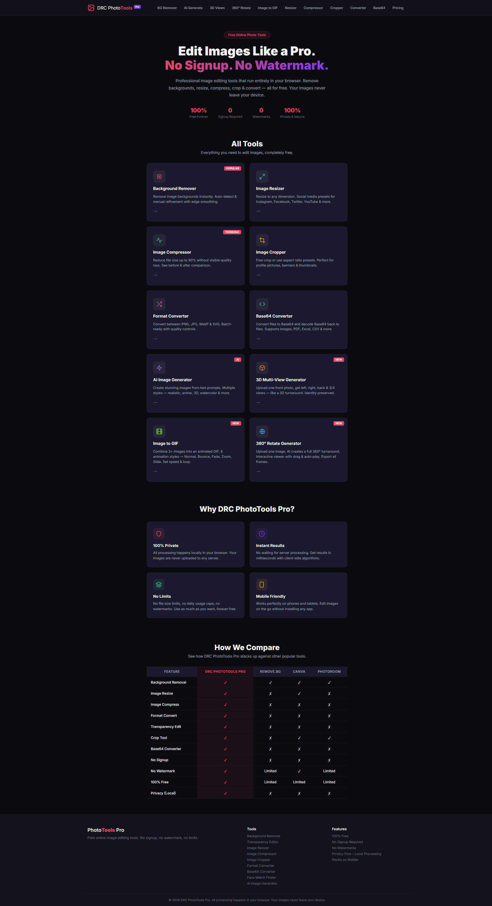
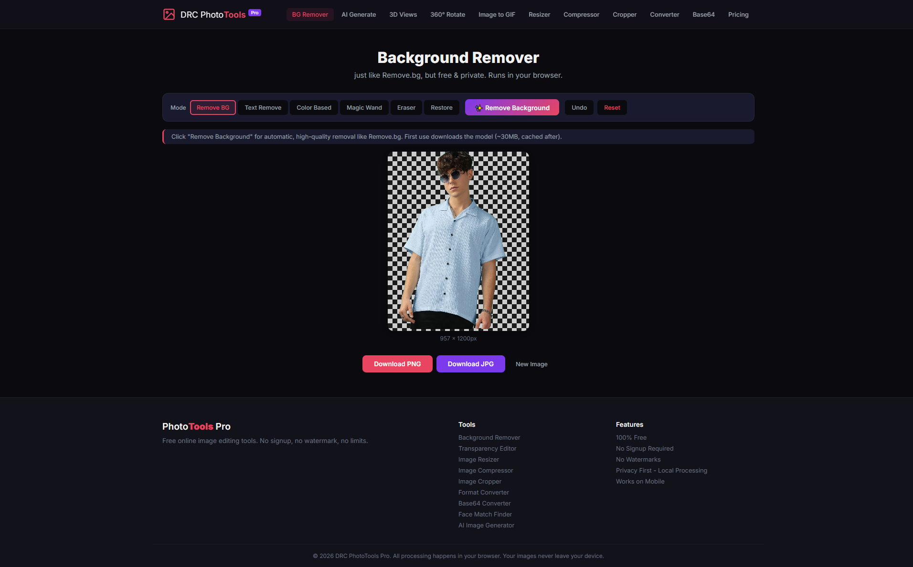
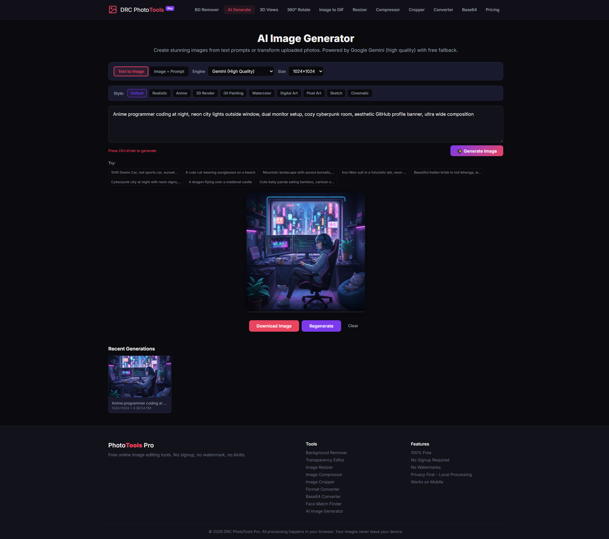
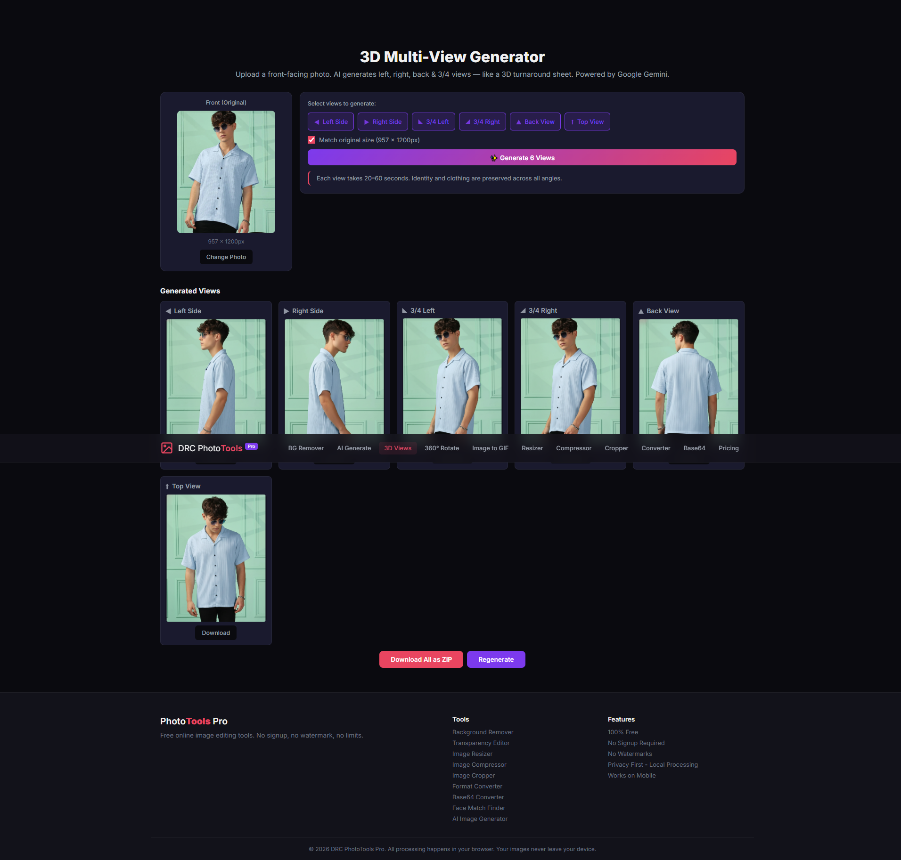
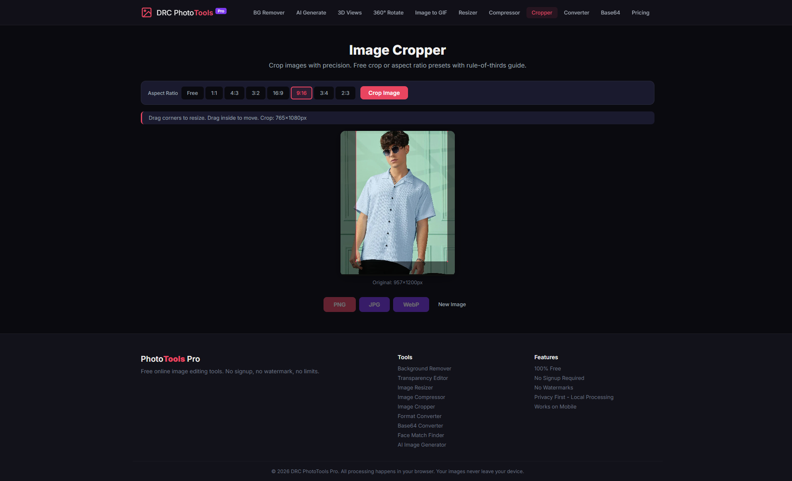

<h1 align="center">🎨 DRC PhotoTools Pro</h1>
<p align="center">All-in-one free photo editing toolkit — right in your browser. No signup. No watermark. 100% private.</p>

<p align="center">
  
  
  
  
  <br />
  
  
  
  
  
</p>

<p align="center">
  
</p>

---

## 📑 Table of Contents

- [About](#-about)
- [Features](#-features)
- [Comparison](#-comparison)
- [Tech Stack](#%EF%B8%8F-tech-stack)
- [Preview / Screenshots](#-preview--screenshots)
- [Prerequisites](#-prerequisites)
- [Installation](#%EF%B8%8F-installation)
- [Environment Variables](#-environment-variables)
- [Usage](#%EF%B8%8F-usage)
- [Project Structure](#-project-structure)
- [Available Scripts](#-available-scripts)
- [Deployment](#-deployment)
- [Contributing](#-contributing)
- [License](#-license)
- [Author](#-author)
- [Support](#-support)

---

## ✨ About

**DRC PhotoTools Pro** is a free, privacy-focused, browser-based photo editing toolkit that bundles the everyday image tools you'd normally pay for or sign up for — background removal, resize, compress, crop, format convert, Base64 and more — into a single fast SPA. Everything runs **locally in your browser**, so your images never leave your device.

---

## 🚀 Features

- 🖼️ **Background Removal** — Remove image backgrounds instantly with auto-detect & edge smoothing
- 📐 **Image Resize** — Resize images to any dimension with social media presets (Instagram, Facebook, Twitter, YouTube)
- 🗜️ **Image Compress** — Reduce file size up to 90% without visible quality loss, with before/after comparison
- 🔄 **Format Convert** — Convert between PNG, JPG, WebP & SVG with quality controls
- 👻 **Transparency Edit** — Add or edit transparency layers
- ✂️ **Crop Tool** — Free crop or aspect ratio presets (perfect for profile pics, banners, thumbnails)
- 🔤 **Base64 Converter** — Convert images, PDF, Excel, CSV & more to/from Base64
- 🎨 **AI Image Generator** — Create images from text prompts in multiple styles (realistic, anime, 3D, watercolor)
- 🧊 **3D Multi-View Generator** — Generate left, right, back & 3/4 views from a single front photo
- 🔁 **360° Rotate Generator** — Turn one image into a full 360° interactive turnaround
- 🎞️ **Image to GIF** — Combine 3+ images into animated GIFs with 6 animation styles
- 🚫 **No Signup Required** — Start using instantly, no email, no account
- 💧 **No Watermark** — Clean, professional output every time
- 🆓 **100% Free** — All features, forever free, no daily caps
- 🔒 **Privacy First (Local Processing)** — All processing happens client-side; your images never leave your device

---

## 🆚 Comparison

| Feature              | DRC PhotoTools Pro | Remove.bg | Canva   | Photoroom |
| -------------------- | :----------------: | :-------: | :-----: | :-------: |
| Background Removal   | ✓                  | ✓         | ✓       | ✓         |
| Image Resize         | ✓                  | ✗         | ✓       | ✗         |
| Image Compress       | ✓                  | ✗         | ✗       | ✗         |
| Format Convert       | ✓                  | ✗         | ✗       | ✗         |
| Transparency Edit    | ✓                  | ✗         | ✗       | ✗         |
| Crop Tool            | ✓                  | ✗         | ✓       | ✓         |
| Base64 Converter     | ✓                  | ✗         | ✗       | ✗         |
| No Signup            | ✓                  | ✗         | ✗       | ✗         |
| No Watermark         | ✓                  | Limited   | ✓       | Limited   |
| 100% Free            | ✓                  | Limited   | Limited | Limited   |
| Privacy (Local)      | ✓                  | ✗         | ✗       | ✗         |

---

## 🛠️ Tech Stack

| Layer            | Library                                                  |
| ---------------- | -------------------------------------------------------- |
| UI Framework     | [React 19](https://react.dev)                            |
| Build Tool       | [Vite 8](https://vitejs.dev)                             |
| Routing          | [React Router DOM 6](https://reactrouter.com)            |
| Background Removal | [@imgly/background-removal](https://github.com/imgly/background-removal-js) |
| Face Detection   | [@vladmandic/face-api](https://github.com/vladmandic/face-api) |
| ZIP Handling     | [jszip](https://stuk.github.io/jszip/)                    |
| AI Image Gen     | Google Gemini API + Pollinations (proxied)               |
| Linting          | ESLint 9 + react-hooks plugin                            |

---

## 📸 Preview / Screenshots

<p align="center">
  
  <br /><em>All tools at a glance — the home dashboard.</em>
</p>

<p align="center">
  
  <br /><em>Background Removal in action — instant, client-side.</em>
</p>

<p align="center">
  
  <br /><em>Image Compress & Resize workflow with live preview.</em>
</p>

<p align="center">
  
  <br /><em>AI & GIF generator views.</em>
</p>

<!-- TODO: please confirm/replace screenshot captions to match the exact tool shown -->

---

## 📋 Prerequisites

- **Node.js** ≥ 18.x (recommended: 20.x LTS)
- **npm** ≥ 9.x (or `yarn` / `pnpm` if you prefer)
- A modern Chromium-based or Firefox browser for dev

---

## ⚙️ Installation

```bash
# Clone the repo
git clone <repo-url>
cd react-photo-tools

# Install dependencies
npm install

# Start dev server
npm run dev
```

Then open <http://localhost:5173> in your browser.

To create a production build:

```bash
npm run build
npm run preview
```

---

## 🔧 Environment Variables

Create a `.env.local` file in the project root with the following keys:

| Name                       | Description                                          | Default                    |
| -------------------------- | ---------------------------------------------------- | -------------------------- |
| `VITE_GEMINI_API_KEY`      | Google Gemini API key — required for AI Image Gen.   | `__YOUR__GEMINI_API_KEY___` |
| `VITE_GEMINI_IMAGE_MODEL`  | Gemini image model identifier.                       | `gemini-2.5-flash-image`   |

> ⚠️ The Gemini key ships with the client bundle in production. For public deployments, proxy the call through your own backend so the key stays server-side.

---

## ▶️ Usage

| Tool                     | What it does                                                                |
| ------------------------ | --------------------------------------------------------------------------- |
| Background Remover       | Drop an image, get a transparent PNG back instantly.                        |
| Image Resizer            | Set custom dimensions or pick a social-media preset.                        |
| Image Compressor         | Drag a file in, see size-savings preview, download the lighter version.     |
| Image Cropper            | Free crop or use aspect-ratio presets for profile pics, banners, thumbs.    |
| Format Converter         | Switch between PNG / JPG / WebP / SVG with quality controls.                |
| Base64 Converter         | Convert any file to a Base64 string, or paste Base64 to get the file back.  |
| AI Image Generator       | Type a prompt, choose a style, get a generated image.                       |
| 3D Multi-View Generator  | Upload one front photo, get left/right/back/3-quarter views.                |
| 360° Rotate Generator    | Upload one image, get a full 360° turnaround with interactive viewer.       |
| Image to GIF             | Combine 3+ images into an animated GIF with speed/loop/animation controls.  |

---

## 📁 Project Structure

```text
react-photo-tools/
├── public/                # static assets, face-api models, web.config
│   ├── favicon.svg
│   ├── icons.svg
│   ├── models/
│   └── web.config
├── src/
│   ├── assets/            # images + Screen_Short/ folder
│   ├── components/        # Navbar, Footer, ToolCard, FileUploader
│   ├── pages/             # one file per tool route
│   ├── utils/             # download, gemini, gifEncoder, imageProcessing, security
│   ├── App.jsx
│   ├── App.css
│   ├── index.css
│   └── main.jsx
├── index.html
├── vite.config.js
├── eslint.config.js
├── deploy.ps1
├── DEPLOY.md
└── package.json
```

---

## 🧪 Available Scripts

| Script           | What it does                                            |
| ---------------- | ------------------------------------------------------- |
| `npm run dev`    | Start Vite dev server with HMR.                         |
| `npm run build`  | Produce a production build in `dist/`.                  |
| `npm run preview`| Serve the production build locally for smoke testing.   |
| `npm run lint`   | Run ESLint across the project.                          |

---

## 🌐 Deployment

The project builds to a static `dist/` folder and can be deployed anywhere static hosting is available:

- **Vercel** — `vercel --prod` (auto-detects Vite).
- **Netlify** — drag-and-drop `dist/`, or connect the repo with build command `npm run build` and publish dir `dist`.
- **GitHub Pages** — push `dist/` to a `gh-pages` branch (set Vite `base` if hosting under a sub-path).
- **IIS (Windows Server)** — see [DEPLOY.md](./DEPLOY.md) for the full step-by-step guide (includes URL Rewrite, ARR proxy, HTTPS).

---

## 🤝 Contributing

1. **Fork** the repository.
2. Create a branch: `git checkout -b feat/your-feature`.
3. Commit your changes: `git commit -m "feat: add your feature"`.
4. Push and open a **Pull Request** against `main`.

Issues and feature suggestions are welcome — please include screenshots/repro steps where it helps.

---

## 📄 License

<!-- TODO: please fill in — no LICENSE file detected in the project root -->
MIT (recommended) — add a `LICENSE` file in the project root to make this binding.

---

## 👨‍💻 Author

**DRC**

- 📧 Email: [info@drcinfotech.com](mailto:info@drcinfotech.com)
- 🌐 Project Link: [github.com/drcinfotech/DRC_PhotoTools](https://github.com/drcinfotech/DRC_PhotoTools)

---

<!-- TODO: please fill in your real GitHub username / contact -->

---

## ⭐ Support

If you find this useful, please give it a ⭐ on GitHub!
